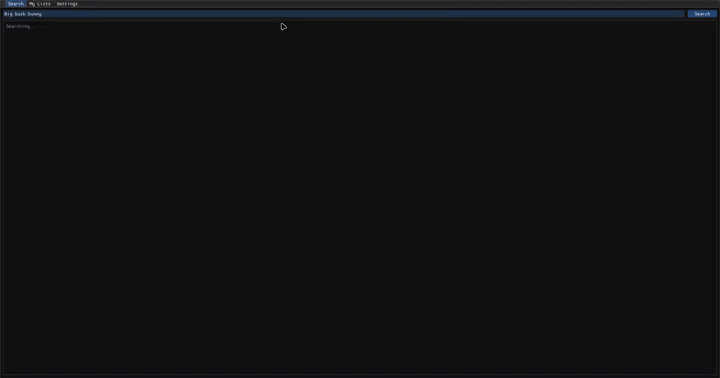

# ImTube

**ImTube** is a lightweight YouTube client for Linux, built for embedded systems
(the **STM32MPU** / OpenSTLinux) and desktop PCs. It is a single-window,
Dear ImGui application that searches, browses and plays YouTube videos with
hardware-accelerated rendering and low CPU/RAM overhead.



The whole stack is deliberately small: no Qt, no GTK, no Electron. The pieces are
**Dear ImGui** (UI), **SDL3** (window/input), **GStreamer** (decode + playback),
**yt-dlp** (YouTube extraction) and a thin render abstraction with **OpenGL ES 3.2**
(default) and **Vulkan** (optional) backends.

---

## Features

* YouTube search and URL playback
* Video browsing with thumbnails (libcurl downloader, decoded in a worker thread)
* Streaming playback up to 1080p, with a seekable progress bar
* Play / pause / stop, mute + volume slider, playback speed (0.5x – 2x)
* Fullscreen mode (`F11`, `Esc` to leave)
* Subtitles (fetched by yt-dlp, parsed from VTT/SRT, drawn over the video)
* "Like" and "Watch Later" per video, persisted to disk
* Download videos to a configurable folder (`<video_id>.mp4`)
* Navigation history + video URL cache
* Lightweight embedded UI with touchscreen-friendly controls

---

## How it works

### Components

```text
            ImTube (single process)
   ┌────────────────┬──────────────────┐
   │                │                  │
   ▼                ▼                  ▼
 Dear ImGui      yt-dlp             GStreamer
 (UI)          (extractor)          (decode)
   │                │                  │
   │  commands ─────►                  │
   │                │                  │
   │                └─► bytes (stdout)►│
   │                   pipe into appsrc│
   │◄───────────────┼──────────────────┘
   │    raw RGBA frames (CPU memory)
   ▼
 RenderBackend
 GLES 3.2 / Vulkan
   │
   ▼
 GPU  →  Display

Order: yt-dlp → GStreamer → ImGui → RenderBackend (GLES/Vulkan) → GPU → Display
```

The data flows one way through the components. `yt-dlp` extracts the media and
writes its bytes to stdout; GStreamer reads those bytes (through an `appsrc`
pipe), decodes them and hands back raw RGBA frames in CPU memory. ImGui (the
UI) receives those frames and uploads each one into a GPU texture. It does not
render directly: ImGui only issues draw commands, and the RenderBackend
(`VulkanContext` or `GlesContext`) executes them on the GPU before the frame is
presented to the display. In short, ImGui sits *in front of* Vulkan/GLES — it
is the user interface, while the backend is the renderer that draws it.

| Piece | Responsibility |
| --- | --- |
| `src/ui/ImTubeUI.*` | The whole UI: search, result grid, player view, tabs, persistence. |
| `src/core/YtDlpHelper.*` | Shells out to `yt-dlp` for search JSON, stream bytes, subtitles, downloads and direct-URL lookups. |
| `src/core/GStreamerPlayer.*` | Owns the GStreamer pipeline, the byte-feeding thread, seeking, rate changes and the decoded frame buffer. |
| `src/core/SubtitleParser.*` | Parses VTT/SRT files into timed cues. |
| `src/core/ThumbnailLoader.*` | Downloads/decodes thumbnail JPEGs off the UI thread. |
| `src/render/RenderBackend.h` | Texture-upload + ImGui-render interface. `GlesContext` (default) and `VulkanContext` implement it. |
| `src/app/App.*` | SDL3 window, main loop, render-backend selection, ImGui setup. |

### Playback pipeline (the interesting part)

Playback does **not** hand a YouTube URL to GStreamer. `yt-dlp` is the fetcher:
it downloads the media and its stdout becomes the byte source.

```text
YouTube
   │  yt-dlp downloads video (+audio) streams, merges with ffmpeg
   ▼
yt-dlp  (forked with -f bv*+ba --merge-output-format mkv -o - <url>)
   │  writes merged MKV/MP4 bytes to stdout
   ▼
pipe (128 KiB chunks)
   │  feeder thread (GStreamerPlayer.cpp)
   ▼
appsrc ──► decodebin ──┬──► queue ► videoconvert ► videoscale ► capsfilter(RGBA) ► appsink
                       └──► queue ► audioconvert ► volume ► audioresample ► autoaudiosink
   │
   ▼
appsink delivers raw RGBA frames in CPU memory  (pull_frame)
   │
   ▼
UI uploads each frame into a GPU texture  (RenderBackend::create_texture / upload)
   │
   ▼
ImGui::Image(texture)  — rendered by the GLES/Vulkan backend
```

Key points:

* **Format selection.** For resolutions above 360p YouTube only offers separate
  DASH video+audio tracks, so `yt-dlp` is asked for `bv*[height<=N]+ba` and merges
  them with ffmpeg into a single MKV stream on stdout. Below that a single
  progressive (combined) stream is used for instant start. On the embedded
  (STM32MPU) build a single H.264 (`avc1`) stream is selected so the VPU
  hardware decoder can be fed directly.
* **`appsrc` accepts raw bytes.** `decodebin` typefinds the container and demuxes
  it; the demuxer derives timestamps, so `do-timestamp` stays off.
* **`appsink` holds one frame.** It keeps only the newest frame (`max-buffers=1`,
  `drop=true`) for low latency and is clock-synced so playback-rate changes speed
  up video as well as audio.
* **GStreamer never touches the GPU.** Frames leave `appsink` as RGBA in RAM and
  are copied into a GPU texture once per frame by the app. (The long-term goal is
  a zero-copy DMABUF path.)
* **Audio** is routed through a `volume` element that the mute button and volume
  slider drive.

### Seeking

A byte stream from a pipe cannot be repositioned, so seeks are handled by
**restarting** the stream at an offset:

1. `yt-dlp -g` is run in the background at start to cache the direct video/audio
   URLs.
2. On seek, `ffmpeg -ss <time> -i <video_url> … -f matroska pipe:1` is forked and
   its stdout feeds the same `appsrc` path, starting playback at the new position.

### Playback speed

Speed changes push a rate-changing `SEGMENT` event onto the video branch
(`GStreamerPlayer.cpp`), which the clock-synced `appsink` honours.

### Subtitles

`yt-dlp` downloads subtitle files for the video, `SubtitleParser` parses them
into timed cues, and the player draws the active cue over the video. Subtitle
status ("Loading subtitles…", "No subtitles available") is shown at the bottom of
the player controls.

### Persistence

History, liked/watch-later flags and the URL cache are stored in
`~/.cache/imtube/lists.json` (mirrors FLTube's userdata layout). Downloads default
to `~/Downloads`.

---

## UI

The app is a single window with a menu bar and three tabs:

* **Search** – search box, result grid (thumbnails, title, uploader, duration).
* **My Lists** – History / Liked / Watch Later.
* **Settings** – default stream resolution, navigation/URL-cache toggles, download
  folder, yt-dlp binary path and version check.

Clicking a result opens the player view:

```text
┌──────────────────────────────────────────────────────────┐
│  [video area] ............................................ │
│                                       [Progress bar ▓▓▓▓ ] │
│  [Pause][Stop][Expand][Mute] [Vol: 100%]  title........... │
│  [1x combo] Speed  [Subtitles]  Resolution: 1080p         │
│  [Like] [Watch Later]                                     │
│  [Cancel] [Download]  Folder: ~/Downloads                 │
└──────────────────────────────────────────────────────────┘
```

Keyboard shortcuts: `F11` fullscreen, `Esc` leave fullscreen, `Ctrl+Q` quit,
`Alt+S` / `Alt+L` / `Alt+T` switch tabs.

---

## Rendering backends

Rendering goes through the small `RenderBackend` interface
(`src/render/RenderBackend.h`):

* **GLES 3.2** (`GlesContext`) — the default. Runs on any Linux PC via Mesa and
  on the STM32MPU via the VeriSilicon `gcnano` driver.
* **Vulkan** (`VulkanContext`) — optional, PC-focused. The STM32MPU Vulkan
  driver is still immature, so GLES is the safe default on hardware.

Selected at configure time with `-DIMTUBE_RENDERER=gles|vulkan`.

---

## Building

Dependencies: CMake ≥ 3.24, a C++20 compiler, `pkg-config`, GStreamer 1.0 dev
packages (`gstreamer-1.0`, `gstreamer-app-1.0`, `gstreamer-video-1.0`), OpenGL ES
headers (`glesv2`, `egl`) and `libcurl`. Dear ImGui is vendored under `src/libraries/imgui`; stb is vendored under
`src/libraries/stb`. SDL3 and nlohmann/json are fetched and built by CMake
automatically (or resolved from system packages in cross-builds).

### Linux PC (GLES, default)

```sh
cmake --preset gles        # or: cmake -S . -B build -G Ninja
cmake --build build
./build/imtube
```

### Linux PC (Vulkan)

```sh
cmake --preset vulkan      # needs a Vulkan loader + ICD
cmake --build build-vk
./build-vk/imtube
```

### STM32MPU (Yocto / OpenSTLinux)

Build the ImTube recipe as part of your Yocto image (e.g. `bitbake
st-image-weston`). The recipe is under `recipes-multimedia/imtube/` in the
`meta-watermelon-wine` layer. Enable it by adding `packagegroup-multimedia`
to `CORE_IMAGE_EXTRA_INSTALL` in your `conf/local.conf`:

```
CORE_IMAGE_EXTRA_INSTALL:append = " packagegroup-multimedia"
```

The recipe builds with:

```
-DIMTUBE_EMBEDDED:BOOL=ON -DIMTUBE_IMGUI_DIR:PATH=${S}/src/libraries/imgui
```

On the target you need `yt-dlp`, GStreamer with the H.264 hardware elements,
and a Wayland compositor (Weston).

### Tests

Unit tests cover the parser/helper logic (playback-rate math, subtitle parsing,
URL helpers) with no network or display required:

```sh
ctest --test-dir build --output-on-failure
```

---

## CMake options

| Option | Default | Meaning |
| --- | --- | --- |
| `IMTUBE_RENDERER` | `gles` | `gles` or `vulkan` |
| `IMTUBE_EMBEDDED` | `OFF` | STM32MPU tuning (single H.264 stream, no tests) |
| `IMTUBE_WITH_CURL` | `ON` | libcurl thumbnail downloads (otherwise placeholders) |
| `IMTUBE_BUILD_IMGUI_DEMO` | `OFF` | Compile the Dear ImGui demo window into the app |

---

## Debugging and automated UI tests

With `IMTUBE_DEBUG=1`, the UI prints a periodic `[geo]` geometry dump
(window, search box, results, thumbnails, transport controls, resolution radio
buttons, …) to stderr. Automated UI tests drive the window with synthetic X11
input, watch the log for element geometry, and screenshot-verify the layout
(positions of the pause/stop/expand/mute buttons, the speed combo, the subtitle
status line, etc.).

---

## Project layout

```text
src/
├── app/            SDL3 window, main loop, render-backend setup
├── core/           yt-dlp helper, GStreamer playback, thumbnails, subtitles
│   ├── GStreamerPlayer.*   pipeline, feeder thread, seek, speed, frames
│   ├── YtDlpHelper.*       yt-dlp process management (search/stream/subs/download)
│   ├── SubtitleParser.*    VTT/SRT parsing
│   ├── ThumbnailLoader.*   background thumbnail download+decode
│   └── PlaybackRate.*      playback-rate helpers
├── libraries/imgui/  vendored Dear ImGui (docking branch) + sdl3/opengl3/vulkan backends
├── libraries/stb/    vendored stb_image (header-only thumbnail decode)
├── render/         RenderBackend / RenderTexture + GLES & Vulkan impls
└── ui/             ImTubeUI (all UI + app logic glue)
tests/test_main.cpp         unit tests (ctest)
```

---

## Target hardware

The primary embedded target is the **STM32MPU** family (STM32MP1 and STM32MP2,
running OpenSTLinux with Wayland/Weston). The app is developed and tested on
desktop Linux (GLES via Mesa or Vulkan) and cross-compiled for the board.

---

## Dependencies / third-party

* [Dear ImGui](https://github.com/ocornut/imgui) – UI (vendored under `src/libraries/imgui`, docking branch)
* [stb](https://github.com/nothings/stb) – image decode (vendored under `src/libraries/stb`)
* [SDL3](https://github.com/libsdl-org/SDL) – platform/window/input
* [GStreamer](https://gstreamer.freedesktop.org/) – media playback
* [yt-dlp](https://github.com/yt-dlp/yt-dlp) – YouTube extraction
* nlohmann/json, libcurl – JSON parsing, thumbnail downloads

> **yt-dlp note:** YouTube changes frequently and breaks old versions. Install a
> recent `yt-dlp`. The app resolves the default `yt-dlp` binary to
> `~/.local/bin/yt-dlp` when that file exists, so the easiest setup is:
>
> ```sh
> curl -L -o ~/.local/bin/yt-dlp https://github.com/yt-dlp/yt-dlp/releases/latest/download/yt-dlp
> chmod +x ~/.local/bin/yt-dlp
> ```
>
> An explicit path can be set in **Settings**; the tab warns when the detected
> version is too old, and playback failures surface the yt-dlp error output.

Each third-party component retains its own license.
